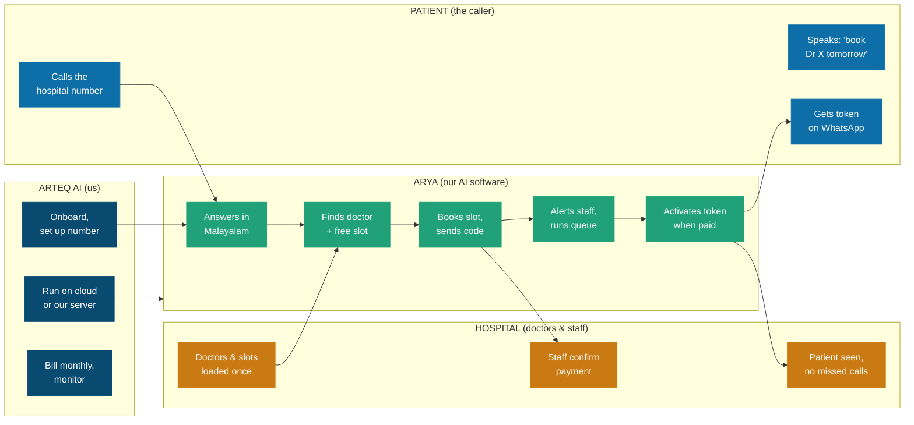

# Arya by Arteq AI
## The AI Voice Receptionist for Hospitals & Clinics
### Founder Update — what we built, and the business behind it

*Updated June 2026. All figures in Indian Rupees (₹). Prices exclude 18% GST.*

> **In one sentence:** Arya answers every hospital phone call in Malayalam and 5 other languages, 24×7, on every line at once — she books appointments, confirms them on WhatsApp, manages the patient queue, alerts staff for emergencies, and never puts a caller on hold.

**What's inside**

1. What we shipped — the full product, in plain language
2. How it works — workflow from every point of view
3. Pricing plans
4. What it cost us to build (fixed costs)
5. What it costs to run, per minute
6. Ways we can deliver the service, and their cost
7. Expected monthly recurring revenue (MRR)
8. Where we stand & what's next

---

## 1. What we shipped

Arya is live and feature-complete. Below is everything she can do today, in plain language. Each item is fully working, not a plan.

**Answering & conversation**

- **6 languages.** Arya speaks Malayalam, Hindi, Tamil, Telugu, Kannada and English, and switches to the caller's language automatically.
- **Always on.** She picks up instantly and handles unlimited calls at the same time — no hold music, no queue, no missed calls after hours.
- **Human-like.** She sounds natural and replies fast. Common phrases are pre-voiced and reused, so there is no robotic delay.
- **Native Malayalam, not translated.** Arya speaks like a real Malayali receptionist — correct grammar, natural contractions, clean punctuation, and zero filler sounds ("ഉം", "umm"). No word-for-word English-to-Malayalam translation.
- **Understands real names.** She matches a doctor whether the caller says "Dr Anil", "ഡോക്ടർ അനില്", or just the specialty ("a cardiology doctor") — and never wrongly says a listed doctor is unavailable.

**Appointments & the patient queue**

- **Self-service booking.** Patients can book, reschedule or cancel an appointment entirely by voice. Arya knows doctors, departments, and timings.
- **Confirmation code.** Every booking gets a short code (e.g. ARYA-7K2P) the patient can quote at the desk.
- **Pay-then-token.** The patient pays the fee at the hospital; the moment staff mark it paid, Arya activates the patient's queue token and messages them the token number. No payment, no token — clean and fair.
- **Smart priority.** Emergencies and senior citizens are automatically pushed up the queue, so the most urgent patients are seen first.
- **Load balancing.** If a department has several doctors, Arya routes the patient to the least-busy one, balancing the load across the team.
- **No double-booking.** Two patients grabbing the same slot at the same instant can never double-book — the system locks the slot safely.

**Messaging & staff alerts**

- **WhatsApp-first.** Confirmations and reminders go out on WhatsApp, with an automatic SMS fallback if WhatsApp can't be delivered.
- **Staff alerts.** Staff get an instant alert for new bookings, cancellations, and especially emergencies, so a human is always in the loop.
- **Live transfer.** Arya can transfer a live call to a human staff member when the caller asks or when she judges it necessary.

**Automatic follow-ups (runs on its own)**

- **Outbound engine.** Appointment reminders before the visit, confirmation requests, missed-call callbacks, and post-visit follow-ups — all sent automatically on a schedule, with no staff effort.

**Dashboard & multi-hospital**

- **Owner dashboard.** A web dashboard shows call logs, bookings, costs, and live activity, protected by secure staff login.
- **Multi-tenant.** One system runs many hospitals and clinics at once, each with its own doctors, persona name, and data kept private and separate.
- **Private & secure.** Hospital data stays isolated per tenant and access is authenticated — built with patient privacy in mind.

**Integrations & onboarding**

- **Connects to hospital systems.** Arya has a built-in integration layer (HIS adapter) that lets her plug into a hospital's existing software or a partner CRM — so bookings and patient data can flow both ways instead of living in a silo.
- **One-shot onboarding.** A new hospital — with its departments, doctors, schedules and FAQs — can be set up in a single step, then go live the same day.
- **Outbound campaigns.** Beyond answering calls, Arya can run scheduled outbound campaigns (reminders, confirmations, follow-ups) to a list of patients, fully automatically.

**Deployment**

- **Two ways to run.** Arya can run on managed cloud for a fast launch, or be fully self-hosted on a single low-cost server we control — same quality, lower cost. Both are packaged in containers, so setup is repeatable.

---

## 2. How it works — from every point of view

The same call touches four groups. Time runs left to right across five stages: **Call in → Match → Book → Manage → Visit.**

**Read it like this:** Each box group is one party. The patient just talks. Arya (green) does all the work in the middle. The hospital only loads its doctors once and confirms payments. We (Arteq) set it up, run it, and bill a simple monthly fee.

---

## 3. Pricing plans

Each plan is a monthly subscription with a block of included talk-time. Extra minutes are billed at the plan rate + ₹0.50/min.

| Plan | Included | Monthly | ₹/min | Best for |
|---|---:|---:|---:|---|
| **Starter** | 1,000 min | ₹6,999 | 7.00 | Single-doctor clinics |
| **Growth** | 2,500 min | ₹14,999 | 6.00 | Small clinics |
| **Professional** | 30,000 min | ₹1,34,999 | 4.50 | Mid-size hospitals |
| **Enterprise** | 60,000 min | ₹2,39,999 | 4.00 | Large hospitals |
| **Enterprise+** | 100,000 min | ₹3,49,999 | 3.50 | Multi-specialty groups |

Every plan includes: 6 languages, 24×7 answering, unlimited simultaneous calls, voice booking, WhatsApp + SMS confirmations, queue tokens, priority & load balancing, live transfer, staff alerts, and the owner dashboard.

> **Add-ons:** One-time setup (number, data load, staff training): ₹10,000–₹25,000. Optional 14-day free trial capped at ~300 min (our cost under ₹900). All prices exclude 18% GST.

---

## 4. What it cost us to build

Fixed and tooling costs to design, build and stand up Arya. Most are monthly subscriptions during the build; the engineering itself was done in-house.

| Item | What it's for | Cost |
|---|---|---|
| **Claude Code (AI dev)** | Building the whole product | ₹1,500–1,800/mo |
| **Groq API** | The AI "brain" (reasoning) | Pay-per-use, ~₹0.20/min |
| **Sarvam API** | Speech-to-text + voice (Indian langs) | Pay-per-use, ~₹0.65/min |
| **LiveKit** | Voice call infrastructure (open-source) | Free self-host / cloud per-min |
| **Plivo** | Phone numbers + WhatsApp/SMS | ~₹0.60/min + number rent |
| **Supabase** | Database (patient & booking data) | Free tier → ~₹2,000/mo |
| **VPS (Hostinger)** | Server to run Arya | ₹799/mo (renews ~₹1,400) |
| **Domain + misc** | Web address, certificates | ~₹1,000/yr |

> **The key point:** Almost everything is pay-as-you-go. We don't pay for idle capacity — the big costs (Groq, Sarvam, Plivo) are only charged per minute Arya is actually on a call. Fixed monthly spend during build is roughly ₹5,000–6,000, mostly tooling.

---

## 5. What it costs to run, per minute

Every minute Arya is on a call, we pay these providers. We run two setups and move customers to the cheaper self-hosted one as volume grows.

| Cost component | Managed Cloud | Self-hosted VPS |
|---|---:|---:|
| Phone line (Plivo) | ₹0.60 | ₹0.60 |
| Voice infra (LiveKit) | ₹1.20 | ~₹0.10 |
| Speech understanding (Sarvam) | ₹0.50 | ₹0.50 |
| Speech voice (Sarvam) | ₹0.15 | ₹0.15 |
| AI brain (Groq) | ₹0.20 | ₹0.20 |
| SMS / WhatsApp + buffer | ₹0.10 | ₹0.10 |
| **Total per minute** | **~₹2.75** | **~₹1.65** |

Self-hosting drops the voice-infra cost from ₹1.20 to a few paise because one ₹799 server is shared across many clinics (multi-tenant). Quality is identical — only *where* LiveKit runs changes.

---

## 6. Ways we can deliver the service

Three delivery models, same product. They trade setup speed against running cost and margin.

| Option | What it is | Our cost/min | Best when |
|---|---|---:|---|
| **Managed Cloud** | LiveKit's rented cloud; fastest launch | ~₹2.75 | First customers, pilots |
| **Self-hosted VPS** | LiveKit on our ₹799 box, multi-tenant | ~₹1.65 | Default at scale |
| **Dedicated VPS** | One hospital's own box + standby failover | ~₹1.85 | Large hospital wanting isolation |

> **Our recommendation:** Launch new customers on Managed Cloud for a same-day start, then migrate them onto a shared self-hosted box once volume is steady. Keeps onboarding instant while protecting our ~50% margin. Offer a dedicated box (with standby for failover) only to large hospitals that ask.

Per-plan margin stays near 50% across the board: small plans run on cloud (higher cost, higher price), large plans on our own infra (lower cost).

| Plan | Price | Our cost | Gross profit | Margin |
|---|---:|---:|---:|---:|
| Starter | ₹6,999 | ~₹3,000 | **₹3,999** | 57% |
| Growth | ₹14,999 | ~₹7,500 | **₹7,499** | 50% |
| Professional | ₹1,34,999 | ~₹66,000 | **₹68,999** | 51% |
| Enterprise | ₹2,39,999 | ~₹1,20,000 | **₹1,19,999** | 50% |
| Enterprise+ | ₹3,49,999 | ~₹1,80,000 | **₹1,69,999** | 49% |

---

## 7. Expected monthly recurring revenue (MRR)

MRR is the predictable subscription income each month. Three scenarios for the first 12 months, using a realistic Kerala customer mix. "Gross profit" uses our ~50% blended margin.

**A realistic customer mix.** Most clinics land in Starter/Growth; most private hospitals in Professional/Enterprise. We model a blended average revenue per customer of about ₹22,000/month.

| Scenario (by month 12) | Customers | Avg/customer | MRR | Gross profit/mo |
|---|---:|---:|---:|---:|
| **Conservative** | 10 | ₹22,000 | **₹2.2 L** | ~₹1.1 L |
| **Base case** | 25 | ₹22,000 | **₹5.5 L** | ~₹2.75 L |
| **Aggressive** | 50 | ₹24,000 | **₹12.0 L** | ~₹6.0 L |

*L = lakh (₹1,00,000).* Annualised, the base case is roughly **₹66 lakh ARR** with about **₹33 lakh gross profit**, before salaries and marketing.

**Why this is reachable**

- Kerala has thousands of clinics and hundreds of private hospitals — a large, underserved market on phone handling.
- Each closed customer is sticky: once Arya holds their doctors, queue and history, switching cost is high.
- Margin holds at ~50% even as we grow, because larger customers run on our cheaper self-hosted infrastructure.
- A single ₹799 server can carry 20–40 small clinics, so adding customers barely adds cost.

> **The simple pitch:** "One missed call can be one lost patient. Arya answers every call, in Malayalam, day and night, and books the appointment on the spot — for less than the cost of a single receptionist."

---

## 8. Where we stand & what's next

**Done**

- Full product built and working: answering, booking, WhatsApp tokens, priority queue, load balancing, alerts, dashboard, multi-hospital.
- Native-Malayalam speech tuned to sound like a real receptionist — no fillers, correct grammar, robust doctor-name and specialty matching.
- Integration layer (HIS adapter) ready to connect Arya to hospital software or a partner CRM.
- Outbound campaign engine for automated reminders and follow-ups.
- Multi-tenant scale and per-hospital persona, with clearer startup/error visibility for reliable operation.
- Both delivery setups packaged (managed cloud + one-server self-host).

**To go fully live**

- Point the hospital's phone number / WhatsApp line at Arya (one-time setup).
- Load the first hospital's doctors, departments and timings.
- Run the first paid pilot and confirm real-world call quality and cost.

---

*Notes: Figures are indicative, based on June 2026 provider rates — revisit if Plivo / LiveKit / Sarvam / Groq pricing changes. Add 18% GST on all customer prices. MRR scenarios assume the stated customer counts and the blended average revenue per customer; actual results depend on sales pace.*
